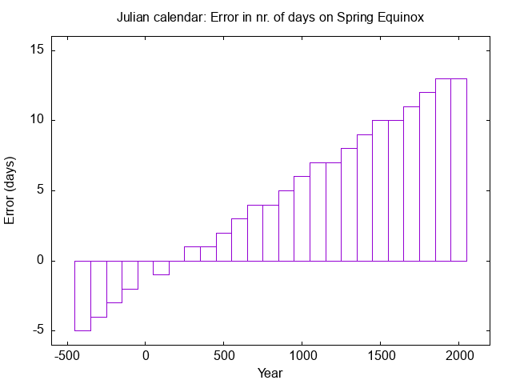
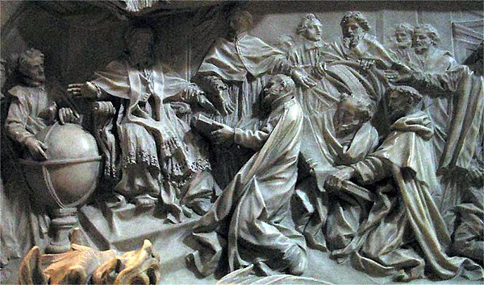

# jdcal

**Go library and CLI utility to convert to-and-fro between Julian and Gregorian dates, offering:**

- Conversions between Julian and Gregorian calendars for any date between 500BC and 2100AD
- When is a year a leap year, on either of the calendars
- Zones: When did which regions switch calendars
- Visualization: How did a calendar look in a given zone around the switch-over date
- Holidays: When did certain holidays occur in a given year, taking into account the full moon dates in that year
- And more.

**Table of Contents**

<!-- toc -->
- [But why?](#but-why)
  - [46 BC](#46-bc)
  - [Around 1582 AD](#around-1582-ad)
  - [Up to 1923 AD (!)](#up-to-1923-ad-)
  - [2023 AD](#2023-ad)
- [Installation](#installation)
- [Short CLI synopsis](#short-cli-synopsis)
  - [Conversions between calendars](#conversions-between-calendars)
  - [Weekdays](#weekdays)
  - [When did the world switch calendars](#when-did-the-world-switch-calendars)
  - [Visualization of a timeline](#visualization-of-a-timeline)
- [Short library synopsis](#short-library-synopsis)
  - [Conversions](#conversions)
  - [Honoring leap years](#honoring-leap-years)
  - [Zones](#zones)
  - [Testing whether a date exists in a zone](#testing-whether-a-date-exists-in-a-zone)
  - [Holidays](#holidays)
  - [More documentation](#more-documentation)
<!-- /toc -->

## But why?

### 46 BC

<table>
<tr>
<td width="100" valign="top">  </td>
<td valign="top">In the year that we refer to as 46 BC the Roman consul Julius Caesar proposed a reform to the previously used lunisolar calendar (which, unsuccessfully, tried to combine both the solar and lunar cycles). The new calendar would be solely based on Solar timing, Lunar cycles would be computed separately. This Julian calendar would have 365.25 days per year: every February would have 28 days, except for years evenly divisible by four. Then the year would be a leap year and Februrary would have 29 days. This calendar took effect on January 1st 45 BC by edict. JC was after all "Dictator Perpetuo" and "Pontifex Maximus". That year needed 445 days (!) to synchronize the previous (and hopelessly out of sync) calendar with the Solar cycle.</td>
</tr>
</table>

(*Image: Julius Caesar, probably the only surviving sculpture created during his life. From https://en.wikipedia.org/wiki/Julius_Caesar*)

Romans would generally avoid numbering years. Preferably they'd refer to a date as "in the year of the consuls so-and-so", or, if needed, they would refer to a year *Ab Urbe Condita*, from the founding of the City, which is probably 753 BC. Julius Caesar of course had no notion of "45 BC". A coordinate shift of the time axis and BC/AD counting were added much later, around 525 AD, when the West Roman empire collapsed. An interesting fact is that when introducing BC/AC and the new time axis, the number zero was not widely recognized. Calendars using BC/AD go from December 31st, 1 BC to January 1st, 1 AD.

Dates going back to 500 BC were backdated to the Julian calendar (probably because dates before 500 BC were unknown anyway). So we can say that the Julian calendar *started* 500 BC in the sense that one may find documents referring to such dates -- though such documents will be written after the introduction of the Julian calendar, so after 45 BC.

<table>
<tr>
<td width="400" valign="top"> </td>
<td valign="top">The Julian calendar was unfortunately not entirely precise. It would postpone a Solar day too often, by too frequently scheduling February 29th. By the year 1500, the longest day (Midsummer night) was on June 11th, instead of the 21st. And the spring Equinox was equally far from March 21st, which gravely hampered the calculations of the Easter festivities.

Interestingly, the equinoxes or solstices did **not** match their "right" dates at the introduction of the Julian calendar. By chance the Julian calendar got the dates right in the third century AD.
</td>
</tr>
</table>

(*Image: Drift of the Julian calendar. There are no data for year zero; that date doensn't exist in BC/AC.*)

### Around 1582 AD

<table>
<tr>
<td width="400" valign="top"> </td>
<td valign="top">In 1582, Pope Gregory XIII ordered a modification so that a year would have 365.2425 days.  (However, 365.2425 days per year is also not precise. We need leap seconds now.) The change meant that a year would be a leap year if the year was divisible by four, but not if it was a century mark (divisible by 100), except if it was a millenium (divisible by 1000). Hence, 1896 would be a leap year (divisble by 4), but 1900 would not (it's a century mark). Also, 1996 would be a leap year, and 2000 as well (it's a millenium).

A further change was that 10 days were skipped in order to align the calendar with the solar cycle: the day following October 4th 1582 would be October 15th, and not the 5th.

</td>
</tr>
</table>

(*Image: Pope Gregory XIII, celebrating the introduction of his calendar. From https://en.wikipedia.org/wiki/Pope_Gregory_XIII.*)

The Papal edict was put in place and recognized by anyone under the authority of the Catholic Church. G13 was after all *Vicarius Christi, Principis Apostolorum, Pontiff,* etc.. Since it was ordered by the Catholics,  others wouldn't accept the change; notably these were the followers of the Protestant Churches, the Eastern Orthodox Churches and the Oriental Orthodox churches.

<table>
<tr>
<td width="400" valign="top"></td>
<td valign="top">So January 1st, 1600 may be a Gregorian date if it's in a historically Catholic zone, and it may be a Julian date if not. Or it may not exist at all if this area switched to the Gregorian calendar around that time. Or it may be both if this area switched back to the Julian calendar.

Near the border of such zones, one could arrange to meet your inlaws on August 1st, and they'd show up on August 11th because that was August 1st on their calendar. One may still find remnants of how people avoided such confusion in phrases like "the market will be held on the the third Sunday after Winter Equinox".</td>
</tr>
</table>

(*Image: Simplified map of switch over dates. From https://familytreemagazine.com/history/gregorian-calendar-adoption-map/*)

### Up to 1923 AD (!)

Eventually even the initial nay-sayers adopted the Gregorian calendar, probably simply because it's more precise and to avoid confusion. An example is USA. The Catholic parts (former French and Spanish colonies) switched to the Gregorian calendar in 1582 AD, as ordered by the Pope. The Protestant parts (formerly British, so Anglican/Protestant) switched in 1752. Alaska switched in 1867, since it was formerly part of the Russian empire and hence Orthodox -- they postponed switching for a loooong time. Though not as long as Greece, which only switched in 1923 AD.

But, even disregarding different switch dates for different areas, this didn't always go smoothly. Some areas fell under Catholic rule (read: were conquered) and were forced to switch to the Gregorian calendar, only to be re-conquered by Protestants and to switch back to the Julian calendar, and finally to switch to the Gregorian calendar again.

A nice example is Switzerland's Appenzell Ausserrhoden:

- They adopted the Gregorian calendar in 1584 (due to Catholic rule),
- Dumped that in favor of the Julian calendar in 1597,
- Kept the Julian calendar for more than 200 years,
- Finally switched to the (obviously better) Gregorian calendar in 1798. 

So before 1585 they were "in sync" with other areas, and until 1798 you don't know -- it depends on their switching dates and on their neighbours.

### 2023 AD

Late 2023 my darling wife asked me to write some conversion software because she's working on a book that has to be historically precise. I dove into the rabbit hole.

## Installation

To install the package, run:

```sh
go install github.com/KarelKubat/jdcal@latest
```

To install the program `jdcal` as a CLI interface, then run:

```sh
cd ~go/src/github.com/KarelKubat/jdcal  # replace ~/go/src with whatever works for you
make install                            # `jdcal` is installed into your ~/go/bin/ or $GOBIN
```

## Short CLI synopsis

To install `jdcal` as a CLI tool, run `go install main/jdcal/jdcal.go`. After this you can use the utility. Start `jdcal` without any arguments to see the usage information.

### Conversions between calendars

```sh
# Take October 5th 1582 as a Julian date and convert
jdcal convert 1582/10/05              # default calendar is Julian
Julian 1582/10/05 is Gregorian 1582/10/15

# Take October 10th 1582 as a Gregorian and convert back
jdcal convert --gregorian 1582/10/15  # or use -g as a short flag
Gregorian 1582/10/15 is Julian 1582/10/05
```

### Weekdays

```sh
# What day was January 1st 1600 on the Julian or Gregorian calendar?
jdcal weekday 1600/1/1
Julian 1600/01/01 is a Tuesday

jdcal weekday 1600/1/1 --gregorian  # or -g as shorthand
Gregorian 1600/01/01 is a Saturday
```

### When did the world switch calendars

```sh
# Switch over dates for zones matching "america"
jdcal zones --zone america
United States of America (French & Spanish colonial empires)
  Started using the Julian    calendar   on   Gregorian -0500/02/28
  Switched to   the Gregorian calendar   on   Julian 1582/12/09
United States of America (British Empire)
  Started using the Julian    calendar   on   Gregorian -0500/02/28
  Switched to   the Gregorian calendar   on   Julian 1752/09/02
United States of America (Russian Empire: Alaska)
  Started using the Julian    calendar   on   Gregorian -0500/02/28
  Switched to   the Gregorian calendar   on   Julian 1867/10/06

# All known zones
jdcal zones
  # Shows a long list
```

### Visualization of a timeline

`jdcal timeline` shows a visualization of the progression of dates. Example:

```sh
# Show the timeline around 1582/10/04
jdcal timeline 1582/10/01 --days 10  # note: --zone is unspecified
     Julian |   |   Gregorian
------------+---+------------
 1582/10/01 | M |  1582/10/11
         02 | T |          12
         03 | W |          13
         04 | T |          14
         05 | F |          15
         06 | S |          16
         07 | S |          17
         08 | M |          18
         09 | T |          19
         10 | W |          20
```

Spain switched over to the Gregorian calendar on October 4th 1582 (try it with `jdcal zones --zone spain`). So the Spanish people went to sleep on October 4th and woke up on the 15th. That year, valid October dates were 1, 2, 3, 4, 15, 16, 17, etc.. Dates like October 10th don't exist in that zone.

One can argue whether October 14th is a valid date as it is the Gregorian version of the switch-over date October 4th. `jdcal` assumes that it is.

The output can be further trimmed by using the flag `--zone` which leaves out unused dates:

```sh
# Show the timeline around 1582/10/04 for zone Spain, which switched over to
# the Gregorian calendar on 1582/10/04.
jdcal timeline 1582/10/01 --days 10 --zone spain
     Julian |   |   Gregorian
------------+---+------------
 1582/10/01 | M |
         02 | T |
         03 | W |
         04 | T |  1582/10/14
            | F |          15
            | S |          16
            | S |          17
            | M |          18
            | T |          19
            | W |          20
```

Zones that switch back from Gregorian to Julian offer interesting timelines. E.g., "Groningen City" temporarily switched back to Julian after being re-conquered by Protestants. This happened on (the Gregorian date) 1594/11/10, which became (Julian) 1594/10/31. (Again, one may argue whether the switch-over date Julian 1594/10/31 is valid. `jdcal` assumes it is.) A visualization:

```sh
jdcal zones -z 'groningen city'
Netherlands (Groningen City)
  Started using the Julian    calendar   on   Gregorian -0500/02/28
  Switched to   the Gregorian calendar   on   Julian 1583/01/01
  Switched to   the Julian    calendar   on   Gregorian 1594/11/10
  Switched to   the Gregorian calendar   on   Julian 1700/12/31

jdcal timeline 1594/11/01 --days 20 --zone 'groningen city' --gregorian
  Gregorian |   |      Julian
------------+---+------------
 1594/11/01 | T |
         02 | W |
         03 | T |
         04 | F |
         05 | S |
         06 | S |
         07 | M |
         08 | T |
         09 | W |
         10 | T |  1594/10/31
            | F |       11/01
            | S |          02
            | S |          03
            | M |          04
            | T |          05
            | W |          06
            | T |          07
            | F |          08
            | S |          09
            | S |          10
```

In this case a date like 1594/11/08 exists twice. Also;

- The date 1594/10/30 must be Gregorian;
- Dates 1594/10/31 until 1594/11/10 exist on both calendars;
- The date 1594/11/11 must be Julian.

## Short library synopsis

### Conversions

```go
package main

import (
	"fmt"
	"log"
	"time"

	"github.com/KarelKubat/jdcal"
)

func main() {
	// October 5th (Julian) was the Papal announcement to skip 10 days.
	// The new date would be October 15 (Gregorian).
	jd0, err := jdcal.New(1582, time.October, 5, jdcal.Julian)
	check(err)

	// to Gregorian
	gd, err := jd0.Convert()
	check(err)
	wd, err := gd.Weekday()
	check(err)
	fmt.Println("From Julian to Gregorian:", jd0, "is", gd, "and it's a", wd)

	// back to Julian
	jd1, err := gd.Convert()
	check(err)
	wd, err = jd1.Weekday()
	check(err)
	fmt.Println("And back again:", gd, "is", jd1, "and it's a", wd)

	// Output:
	// From Julian to Gregorian: Julian 1582/10/05 is Gregorian 1582/10/15 and it's a Friday
	// And back again: Gregorian 1582/10/15 is Julian 1582/10/05 and it's a Friday
}

func check(err error) {
	if err != nil {
		log.Fatal(err)
	}
}
```

### Honoring leap years

```go
package main

import (
	"fmt"
	"log"
	"time"

	"github.com/KarelKubat/jdcal"
)

func main() {
	// Advancing dates
	// ---------------
	jd, err := jdcal.New(300, time.February, 27, jdcal.Julian)
	check(err)

	for i := 0; i < 6; i++ {
		gd, err := jd.Convert()
		check(err)
		fmt.Println(jd, "is", gd)
		jd = jd.Advance()
	}

	// Output:
	// Julian 0300/02/27 is Gregorian 0300/02/27
	// Julian 0300/02/28 is Gregorian 0300/02/28
	// Julian 0300/02/29 is Gregorian 0300/03/01  # BOOM, Julian is a day wrong
	// Julian 0300/03/01 is Gregorian 0300/03/02
	// Julian 0300/03/02 is Gregorian 0300/03/03
	// Julian 0300/03/03 is Gregorian 0300/03/04

	// Note that the Julian calendar knows a February 29th, the Gregorian one doesn't.
	// The two calendars diverge after February 28th. This is historically correct.

	// Testing leap years
	// ------------------
	for _, yr := range []jdcal.Year{1796, 1797, 1800, 2000} {
		for _, tp := range []jdcal.Type{jdcal.Julian, jdcal.Gregorian} {
			cyr := jdcal.CalendarYear{Year: yr, Type: tp}
			fmt.Println(cyr, "is a leap year:", cyr.IsLeap())
		}
	}

	// Output:

	// Julian 1796 is a leap year: true        # Standard leap year (divisible by 4)
	// Gregorian 1796 is a leap year: true     # or standard non-leap: Julian and Gregorian
	// Julian 1797 is a leap year: false       # agree
	// Gregorian 1797 is a leap year: false

	// Julian 1800 is a leap year: true        # Century: Julian and Gregorian IsLeap disagree
	// Gregorian 1800 is a leap year: false

	// Julian 2000 is a leap year: true        # Millenium: Julian and Gregorian agree
	// Gregorian 2000 is a leap year: true
}

func check(err error) {
	if err != nil {
		log.Fatal(err)
	}
}
```

### Zones

The package knows about zones, and on which dates these zones switched. Some zones even first switched from Julian to Gregorian, but then back again to Julian, and then forward.

The below code would display zone information in a human readable way, tough a `jdcal.ZoneEntry` holds this as a `struct` that can be programmatically examined.

```go
package main

import (
	"fmt"

	"github.com/KarelKubat/jdcal"
)

func main() {
	for _, e := range jdcal.ZonesByName("netherlands") {
		fmt.Println(e)
	}

	// Output (actual string representations may differ):
	//   Belgium (Southern Netherlands)
	// 		Started using the Julian    calendar   on   Gregorian -0500/02/28
	// 		Switched to   the Gregorian calendar   on   Julian 1582/12/20
	//   Netherlands (Brabant)
	// 		Started using the Julian    calendar   on   Gregorian -0500/02/28
	// 		Switched to   the Gregorian calendar   on   Julian 1582/12/14
	//   Netherlands (Drenthe)
	// 		Started using the Julian    calendar   on   Gregorian -0500/02/28
	// 		Switched to   the Gregorian calendar   on   Julian 1701/04/30
	//   Netherlands (Frisia)
	// 		Started using the Julian    calendar   on   Gregorian -0500/02/28
	// 		Switched to   the Gregorian calendar   on   Julian 1701/12/31
	//   Netherlands (Gelderland)
	// 		Started using the Julian    calendar   on   Gregorian -0500/02/28
	// 		Switched to   the Gregorian calendar   on   Julian 1700/06/12
	//   Netherlands (Groningen City)
	// 		Started using the Julian    calendar   on   Gregorian -0500/02/28
	// 		Switched to   the Gregorian calendar   on   Julian 1583/01/01
	// 		Switched to   the Julian    calendar   on   Gregorian 1594/11/10
	// 		Switched to   the Gregorian calendar   on   Julian 1700/12/31
	//   Netherlands (Holland)
	// 		Started using the Julian    calendar   on   Gregorian -0500/02/28
	// 		Switched to   the Gregorian calendar   on   Julian 1583/01/01
	//   Netherlands (Utrecht, Overijssel)
	// 		Started using the Julian    calendar   on   Gregorian -0500/02/28
	// 		Switched to   the Gregorian calendar   on   Julian 1700/11/30
	//   Netherlands (Zeeland, States General)
	// 		Started using the Julian    calendar   on   Gregorian -0500/02/28
	// 		Switched to   the Gregorian calendar   on   Julian 1582/12/14
}
```

### Testing whether a date exists in a zone

```go
package main

import (
	"fmt"
	"log"
	"time"

	"github.com/KarelKubat/jdcal"
)

const (
	zoneName = "Netherlands (Groningen City)"
)

func main() {
	zones := jdcal.ZonesByName(zoneName)
	if len(zones) != 1 {
		check(fmt.Errorf("name %q does not select one single zone", zoneName))
	}

	fmt.Println(zones[0])
	// Netherlands (Groningen City)
	//   Started using the Julian    calendar   on   Gregorian -0500/02/28
	//   Switched to   the Gregorian calendar   on   Julian 1583/01/01
	//   Switched to   the Julian    calendar   on   Gregorian 1594/11/10
	//   Switched to   the Gregorian calendar   on   Julian 1700/12/31

	// Some dates that lie in between the cutovers.
	for _, year := range []jdcal.Year{1580, 1590, 1600, 1800} {
		test(year, time.January, 1, zones[0])
	}

	// Output:
	//   1580/01/01 is a Julian date
	//   1590/01/01 is a Gregorian date
	//   1600/01/01 is a Julian date
	//   1800/01/01 is a Gregorian date

	// Just around the exact cutover dates.
	for _, date := range []struct {
		year  jdcal.Year
		month time.Month
		day   int
	}{
		// Around the first switch from Julian into the Gregorian calendar
		{year: 1582, month: time.December, day: 31},
		{year: 1583, month: time.January, day: 1},
		{year: 1583, month: time.January, day: 2},
		// Output:
		//   1582/12/31 is a Julian date
		//   1583/01/01 is a Julian date
		//   1583/01/02 is neither a Julian nor a Gregorian date

		// Around the second switch from Gregorian back to Julian
		{year: 1594, month: time.November, day: 9},
		{year: 1594, month: time.November, day: 10},
		{year: 1594, month: time.November, day: 11},
		// Output:
		//   1594/11/09 can be both a Julian and a Gregorian date
		//   1594/11/10 can be both a Julian and a Gregorian date
		//   1594/11/11 is a Julian date

		// Around the third switch back to Gregorian
		{year: 1700, month: time.December, day: 30},
		{year: 1700, month: time.December, day: 31},
		{year: 1701, month: time.January, day: 1},
		// Output:
		//   1700/12/30 is a Julian date
		//   1700/12/31 is a Julian date
		//   1701/01/01 is neither a Julian nor a Gregorian date
	} {
		test(date.year, date.month, date.day, zones[0])
	}
}

func test(year jdcal.Year, month time.Month, day int, z jdcal.ZoneEntry) {
	d, err := jdcal.New(year, month, day, jdcal.Julian)
	check(err)
	jdInZone, err := d.InZone(z)
	check(err)

	d, err = jdcal.New(year, month, day, jdcal.Gregorian)
	check(err)
	gdInZone, err := d.InZone(z)
	check(err)

	fmt.Printf("%4.4d/%2.2d/%2.2d ", year, int(month), day)
	switch {
	case jdInZone && gdInZone:
		fmt.Println("can be both a Julian and a Gregorian date")
	case !jdInZone && !gdInZone:
		fmt.Println("is neither a Julian nor a Gregorian date")
	case jdInZone:
		fmt.Println("is a Julian date")
	default:
		fmt.Println("is a Gregorian date")
	}
}

func check(err error) {
	if err != nil {
		log.Fatal(err)
	}
}
```

### Holidays

```go
package main

import (
	"fmt"
	"log"

	"github.com/KarelKubat/jdcal"
)

func main() {

	for _, yr := range []jdcal.Year{1369, 1370, 1371} {
		cyr := jdcal.CalendarYear{Year: yr, Type: jdcal.Julian}

		for _, h := range []jdcal.Holiday{
			jdcal.Easter,
			jdcal.Ascension,
			jdcal.Pentecost,
		} {
			dt, err := cyr.HolidayDate(h)
			check(err)
			wd, err := dt.Weekday()
			check(err)
			fmt.Println(h, "in", cyr, "falls on", wd, dt)
		}
		fmt.Println()
	}

	// Output:
	// Easter in Julian 1369 falls on Sunday Julian 1369/03/25
	// Ascension day in Julian 1369 falls on Thursday Julian 1369/05/03
	// Pentecost in Julian 1369 falls on Sunday Julian 1369/05/13

	// Easter in Julian 1370 falls on Sunday Julian 1370/04/14
	// Ascension day in Julian 1370 falls on Thursday Julian 1370/05/23
	// Pentecost in Julian 1370 falls on Sunday Julian 1370/06/02

	// Easter in Julian 1371 falls on Sunday Julian 1371/04/06
	// Ascension day in Julian 1371 falls on Thursday Julian 1371/05/15
	// Pentecost in Julian 1371 falls on Sunday Julian 1371/05/25
}

func check(err error) {
	if err != nil {
		log.Fatal(err)
	}
}
```

### More documentation

For more please see the generated docs at https://pkg.go.dev/github.com/KarelKubat/jdcal.
